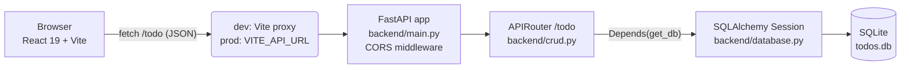

<div align="center">

# TaskFlow

**A full-stack task manager built with FastAPI, SQLAlchemy and React 19.**

Create, edit, complete and delete tasks with optimistic UI updates, instant search & filtering, live progress stats and automatic dark mode — backed by a typed REST API with auto-generated Swagger docs.

[](https://www.python.org/)
[](https://fastapi.tiangolo.com/)
[](https://www.sqlalchemy.org/)
[](https://react.dev/)
[](https://vite.dev/)
[](https://taskflow-beta-eosin.vercel.app)
[](LICENSE)

🔗 **Live demo:** [taskflow-beta-eosin.vercel.app](https://taskflow-beta-eosin.vercel.app)

<!--
TODO once the backend is deployed (Render / Railway / Fly):
📘 **API docs (Swagger):** https://<your-backend-host>/docs
-->

</div>

<!--
TODO: add real screenshots — this is the first thing recruiters look at.
  1. Run backend + frontend locally (see "Getting started"), add 4–5 realistic tasks.
  2. Capture the page at ~1280px wide in light mode and again in dark mode
     (DevTools → Rendering → "Emulate CSS prefers-color-scheme").
  3. Save as docs/screenshot-light.png and docs/screenshot-dark.png, then uncomment:

<p align="center">
  
  
</p>
-->

---

## Table of contents

- [Features](#features)
- [Tech stack](#tech-stack)
- [Architecture](#architecture)
- [Project structure](#project-structure)
- [Getting started](#getting-started)
- [Configuration](#configuration)
- [API reference](#api-reference)
- [Deployment](#deployment)
- [Engineering highlights](#engineering-highlights)
- [Roadmap](#roadmap)
- [Author](#author)
- [License](#license)

---

## Features

| | |
| --- | --- |
| ✅ **Full CRUD** | Create tasks with a title and description, edit them in a modal, toggle completion, delete with confirmation. |
| ⚡ **Optimistic updates** | Toggling a task updates the UI instantly, then syncs with the API — and rolls back automatically if the request fails. |
| 🔍 **Search & filter** | Live, case-insensitive search across titles *and* descriptions, combined with **All / Pending / Done** tabs. |
| 📊 **Progress stats** | Header shows total, pending and completed counts that update in real time. |
| 🌙 **Dark mode** | Follows the OS theme via `prefers-color-scheme`; the whole palette is driven by CSS custom properties. |
| 🛟 **Resilient UI** | Dedicated loading, empty and error states, an error banner with a one-click **Retry**, and defensive validation of every API response. |
| 📘 **Self-documenting API** | FastAPI generates interactive Swagger UI (`/docs`) and ReDoc (`/redoc`) from the typed endpoints. |
| 📱 **Mobile-friendly** | Fluid, centred layout (max-width 900 px) with wrapping controls — usable on phones without a separate mobile stylesheet. |

## Tech stack

**Backend**

- [FastAPI](https://fastapi.tiangolo.com/) — async Python web framework with request validation and OpenAPI generation built in
- [SQLAlchemy 2.0](https://www.sqlalchemy.org/) ORM + SQLite (zero-config local persistence)
- [Pydantic v2](https://docs.pydantic.dev/) request/response schemas
- [Uvicorn](https://www.uvicorn.org/) ASGI server

**Frontend**

- [React 19](https://react.dev/) with hooks (`useState`, `useEffect`) — no state-management library needed at this scale
- [Vite 8](https://vite.dev/) for dev server, HMR and production builds (≈71 kB gzipped bundle)
- Hand-written CSS with design tokens — no UI framework
- [oxlint](https://oxc.rs/docs/guide/usage/linter.html) with React hooks rules

**Tooling / hosting**

- Vercel (frontend, SPA rewrites via `vercel.json`)
- Any ASGI host for the backend (Render, Railway, Fly.io…)

## Architecture



**Request flow, in one paragraph:** the React app keeps the task list in local state and talks to the API with `fetch`. In development, Vite proxies every `/todo` request to the FastAPI server, so there is no CORS or configuration to deal with. In production, the frontend is built with `VITE_API_URL` pointing at the deployed backend. FastAPI validates every payload against Pydantic schemas, opens a per-request SQLAlchemy session through dependency injection, persists to SQLite, and serialises the ORM object back through a typed `response_model`.

## Project structure

```text
TASKFLOW/
├── backend/
│   ├── main.py            # FastAPI app factory: CORS, router registration, health route
│   ├── crud.py            # /todo router (list · create · update · delete) + Pydantic schemas
│   ├── model.py           # SQLAlchemy `ToDo` model
│   ├── database.py        # engine, SessionLocal, `get_db` dependency
│   └── requirements.txt
├── frontend/
│   ├── src/
│   │   ├── App.jsx                # data fetching, optimistic updates, search/filter, stats
│   │   ├── components/
│   │   │   ├── todoform.jsx       # "Create new task" form
│   │   │   ├── todolist.jsx       # task cards + loading / empty states
│   │   │   └── todoedit.jsx       # edit modal
│   │   ├── App.css                # design tokens, dark mode, component styles
│   │   ├── index.css              # reset + base typography
│   │   └── main.jsx
│   ├── index.html
│   ├── vite.config.js             # dev proxy: /todo → http://127.0.0.1:8000
│   └── package.json
├── vercel.json                    # Vercel build settings + SPA rewrite
├── requirements.txt               # same as backend/requirements.txt (for hosts that expect it at the root)
└── README.md
```

## Getting started

### Prerequisites

- **Python 3.10+**
- **Node.js 20.19+** (or 22.12+) and npm — required by Vite 8

### 1. Backend (FastAPI)

```bash
# from the repository root
python -m venv .venv
source .venv/bin/activate          # Windows: .venv\Scripts\activate
pip install -r backend/requirements.txt

uvicorn backend.main:app --reload --port 8000
```

- API: <http://127.0.0.1:8000>
- Swagger UI: <http://127.0.0.1:8000/docs> · ReDoc: <http://127.0.0.1:8000/redoc>

A `todos.db` SQLite file is created automatically in the directory you start the server from — no migrations or seed steps required.

### 2. Frontend (React + Vite)

```bash
cd frontend
npm install
npm run dev
```

Open <http://localhost:5173>. The Vite dev server proxies `/todo` to the backend, so **no environment variables are needed locally**.

### Other scripts

| Command (in `frontend/`) | What it does |
| --- | --- |
| `npm run build` | Production build to `frontend/dist` |
| `npm run preview` | Serve the production build locally |
| `npm run lint` | Run oxlint |

## Configuration

| Variable | Used by | Default | Description |
| --- | --- | --- | --- |
| `VITE_API_URL` | Frontend (build time) | *unset* → `/todo` (relative, works with the dev proxy) | Public URL of the backend, e.g. `https://taskflow-api.onrender.com`. A trailing slash or an explicit `/todo` suffix are both normalised automatically. |

The backend currently uses `sqlite:///todos.db` (see `backend/database.py`). To point it at another database (e.g. Postgres), change `DATABASE_URL` there and add the matching driver to `requirements.txt`.

## API reference

All task routes are mounted under the `/todo` prefix.

| Method | Endpoint | Request body | Success response |
| --- | --- | --- | --- |
| `GET` | `/` | — | `{"message": "ToDo API is running successfully!"}` (health check) |
| `GET` | `/todo/` | — | `ToDo[]` |
| `POST` | `/todo/` | `ToDoCreate` | `ToDo` — the persisted row including its generated `id` |
| `PUT` | `/todo/{id}` | `ToDoCreate` | `ToDo` — `404` if the id does not exist |
| `DELETE` | `/todo/{id}` | — | `{"message": "todo deleted successfully"}` — `404` if the id does not exist |

**Schemas**

```jsonc
// ToDoCreate (request)
{ "title": "string", "description": "string", "done": false }

// ToDo (response)
{ "id": 1, "title": "string", "description": "string", "done": false }
```

**Example**

```bash
curl -X POST http://127.0.0.1:8000/todo/ \
  -H "Content-Type: application/json" \
  -d '{"title": "Ship v1", "description": "Deploy the backend and update VITE_API_URL", "done": false}'
```

Interactive docs with "Try it out" are always available at `/docs`.

## Deployment

**Frontend → Vercel** (already configured)

`vercel.json` builds the `frontend/` workspace, publishes `frontend/dist` and rewrites every route to `index.html`. In the Vercel project settings add the environment variable `VITE_API_URL=<your backend URL>` and redeploy.

**Backend → Render / Railway / Fly.io**

| Setting | Value |
| --- | --- |
| Root directory | repository root |
| Build command | `pip install -r requirements.txt` |
| Start command | `uvicorn backend.main:app --host 0.0.0.0 --port $PORT` |

> **Note on SQLite in production:** most free tiers use an ephemeral filesystem, so the SQLite file is reset on every redeploy/restart. Attach a persistent disk or switch `DATABASE_URL` to a hosted Postgres (Neon, Supabase, Railway) for durable data.

## Engineering highlights

Things in this codebase that go beyond a basic CRUD tutorial:

- **Optimistic UI with rollback.** `handleToggleDone` flips the checkbox in local state immediately, sends the `PUT`, replaces the item with the server's canonical version on success, and re-fetches the list on failure so the UI never drifts from the database.
- **Defensive response handling.** Every fetch checks `res.ok`, and the list is guarded with `Array.isArray` before rendering. This came out of a real production bug — an unexpected non-array payload caused a blank screen on reload — and the fix is [commit `37c9a93`](https://github.com/100rabh-Gupta/TASKFLOW/commit/37c9a9379fe9b65a633194d2e7bb64ef987570d5).
- **Environment-aware API base URL.** `getApiBaseUrl()` normalises `VITE_API_URL` (trailing slashes, optional `/todo` suffix) and falls back to a relative path that the Vite proxy handles in development — one code path for local and production.
- **Dependency-injected DB sessions.** `get_db` yields a session per request and always closes it in `finally`; endpoints declare `response_model`s so FastAPI validates output and generates accurate OpenAPI docs for free.
- **Clear backend layering.** App wiring (`main.py`), routes + schemas (`crud.py`), ORM model (`model.py`) and engine/session (`database.py`) live in separate modules, with a router prefix and tags so the API can grow without touching `main.py`.
- **Design-token CSS.** Colours, radii and shadows are CSS custom properties; dark mode is a single `@media (prefers-color-scheme: dark)` override rather than a second stylesheet.
- **State-complete UI.** Loading, empty, and error states are all designed — including a retry action — instead of leaving the user staring at a blank list.

## Roadmap

- [ ] Server-side validation (`min_length`/`max_length` on `title`) and separate create/update schemas
- [ ] `pytest` + `TestClient` suite and a GitHub Actions CI workflow
- [ ] Authentication (JWT) with per-user task lists
- [ ] Postgres + Alembic migrations, `DATABASE_URL` from environment
- [ ] Due dates, priorities and drag-and-drop ordering
- [ ] Replace `alert`/`confirm` with in-app toasts and dialogs
- [ ] Docker Compose for one-command local setup
- [ ] TypeScript migration of the frontend

## Author

**Saurabh Gupta** — [@100rabh-Gupta](https://github.com/100rabh-Gupta)

<!-- TODO: add LinkedIn / portfolio links here once the portfolio deployment is public
(the current portfolio URL is behind Vercel deployment protection and asks visitors to log in). -->

## License

Released under the [MIT License](LICENSE).
